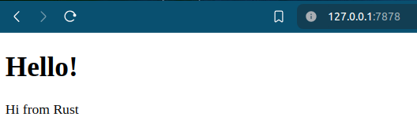
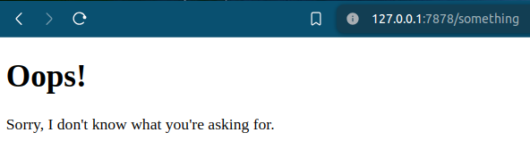

# Building a Multithreaded Web Server

## How to run
- `cd` into `hello`
- `cargo run`
- Send a request by typing `127.0.0.1:7878` into the browser, it will show

- Send a request by typing `127.0.0.1:7878/something` into the browser, it will show


## Theory

### Steps Outline
1. Learn a bit about TCP and HTTP.
2. Listen for TCP connections on a socket.
3. Parse a small number of HTTP requests.
4. Create a proper HTTP response.
5. Improve the throughput of our server with a thread pool.

### TCP and HTTP
The two main protocols involved in web servers are <span style="color:lightgreen">*Hypertext Transfer Protocol (HTTP)*</span> and <span style="color:lightgreen">*Transmission Control Protocol (TCP)*</span>. Both protocols are <span style="color:lightgreen">*request-response*</span> protocols, meaning a client initiates requests and a server listens to the requests and provides a response to the client. The contents of those requests and responses are defined by the protocols.

- <span style="color:lightgreen">*TCP is the lower-level protocol*</span> that describes the details of how information gets from one server to another but doesn’t specify what that information is. 
- <span style="color:lightgreen">*HTTP builds on top of TCP*</span> by defining the contents of the requests and responses. It’s technically possible to use HTTP with other protocols, but in the vast majority of cases, HTTP sends its data over TCP.

#### HTTP Request
HTTP requests follow the format
```
Method Request-URI HTTP-Version CRLF
headers CRLF
message-body
```

Example:
```bash
Request: [
    "GET / HTTP/1.1",
    "Host: 127.0.0.1:7878",
    "Connection: keep-alive",
    "Cache-Control: max-age=0",
    "sec-ch-ua: \"Chromium\";v=\"124\", \"Brave\";v=\"124\", \"Not-A.Brand\";v=\"99\"",
    "sec-ch-ua-mobile: ?0",
    "sec-ch-ua-platform: \"Linux\"",
    "Upgrade-Insecure-Requests: 1",
    "User-Agent: Mozilla/5.0 (X11; Linux x86_64) AppleWebKit/537.36 (KHTML, like Gecko) Chrome/124.0.0.0 Safari/537.36",
    "Accept: text/html,application/xhtml+xml,application/xml;q=0.9,image/avif,image/webp,image/apng,*/*;q=0.8",
    "Sec-GPC: 1",
    "Accept-Language: en-US,en",
    "Sec-Fetch-Site: none",
    "Sec-Fetch-Mode: navigate",
    "Sec-Fetch-User: ?1",
    "Sec-Fetch-Dest: document",
    "Accept-Encoding: gzip, deflate, br, zstd",
    "Cookie: username-127-0-0-1-8888=\"2|1:0|10:1714106648|23:username-127-0-0-1-8888|184:eyJ1c2VybmFtZSI6ICIzMzUwMDc3NWE1MGI0YTVmYjM3ZjhjZjU3ZjcxYzU0YyIsICJuYW1lIjogIkFub255bW91cyBJbyIsICJkaXNwbGF5X25hbWUiOiAiQW5vbnltb3VzIElvIiwgImluaXRpYWxzIjogIkFJIiwgImNvbG9yIjogbnVsbH0=|f4986fc3bd6fe1d8a2249e2196f1d4b8b310afbc91fc4ac56bc7e3ea77c5a7ad\"; _xsrf=2|568d36f2|7ffd01622f9fcc71ce492ff857e41b4e|1714106648",
]
```
where
- `GET / HTTP/1.1` follows the format `Method Request-URI HTTP-Version CRLF`, where
    - <span style="color:yellow">*`URI` (Uniform Resource Identifier)*</span> is almost, but not quite, the same as a Uniform Resource Locator (URL).
    - <span style="color:yellow">*`CRLF` (carriage return and line feed)*</span> are terms from the typewriter days. The CRLF sequence can also be written as `\r\n`, where `\r` is a carriage return and `\n` is a line feed. The CRLF sequence separates the request line from the rest of the request data. Note that when the CRLF is printed, we see a new line start rather than `\r\n`.
    - `GET` is the method, e.g. `PUT`, `POST`... `/` is the request URI, and `HTTP/1.1` is the version.
- After the request line, the remaining lines starting from `Host: 127.0.0.1:7878` onward are headers. `GET` requests have no body.

- Try making a request from a different browser or asking for a different address, such as `127.0.0.1:7878/test`, to see how the request data changes.

#### HTTP Response
HTTP Responses have the following format:

```
HTTP-Version Status-Code Reason-Phrase CRLF
headers CRLF
message-body
```
Example: A HTTP response with version 1.1, has a status code of 200, an OK reason phrase, no headers, and no body
```
HTTP/1.1 200 OK\r\n\r\n
```


### Terminologies
- <span style="color:yellow">*Binding*</span>: connecting to a port to listen to is called "binding" to a port.
- <span style="color:yellow">*Connection*</span>: connection is the name for the full request and response process in which a client connects to the server, the server generates a response, and the server closes the connection
- <span style="color:yellow">*Stream*</span>: a stream represents an open connection between the client and the server


### Notes
- If you send a request to a server, e.g. typing `http://127.0.0.1:7878/` url to your browser, and see the error "This site can’t be reached", it may be that because the server is not currently sending back any data.
- Sometimes, you’ll see multiple messages printed for one browser request; the reason might be that the browser is making a request for the page as well as a request for other resources, like the `favicon.ico` icon that appears in the browser tab. It could also be that the browser is trying to connect to the server multiple times because the server isn’t responding with any data. 

## References
- https://doc.rust-lang.org/book/ch20-00-final-project-a-web-server.html
